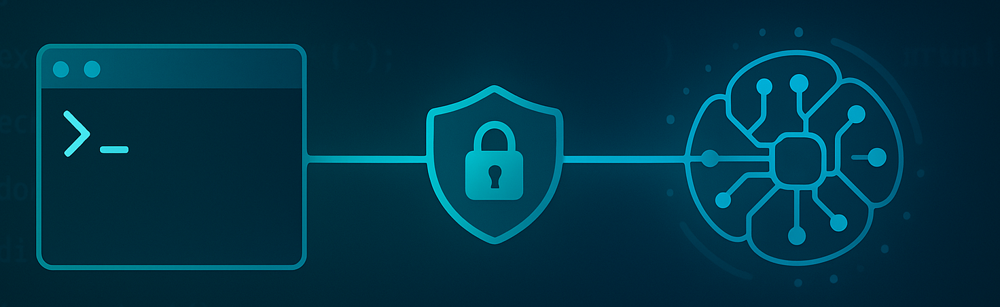

# MCP CLI Adapter

<p align="center">
  
</p>


The **MCP CLI Adapter** is a tool that allows LLMs to safely execute **command-line tools**
through the [**Model Context Protocol (MCP)**](https://modelcontextprotocol.io/).
It provides a secure bridge between LLMs and operating system commands.

## Features

- **Flexible command execution**: Run any shell commands as MCP tools,
  with parameter substitution through templates,.
- **Configuration-based tool definitions**: Define tools in YAML with parameters,
  constraints, and output formatting.
- **Security through constraints**: Validate tool parameters using CEL expressions
  before execution.
- **Robust error handling**: Graceful recovery from panics with detailed logging.
- **Simple integration**: Works with any LLM supporting the MCP protocol.

## Quick Start

Imagine you want Cursor (or some other MCP client) help you with your
space problems in your hard disk.

1. Create a configuration file `example.yaml` defining your tools:

   ```yaml
   mcp:
     description: |
       Tool for analyzing disk usage to help identify what's consuming space.
     run:
       shell: bash
     tools:
       - name: "disk_usage"
         description: "Check disk usage for a directory"
         params:
           directory:
             type: string
             description: "Directory to analyze"
             required: true
           max_depth:
             type: number
             description: "Maximum depth to analyze (1-3)"
             default: 2
         constraints:
           - "directory.startsWith('/')"  # Must be absolute path
           - "!directory.contains('..')"  # Prevent directory traversal
           - "max_depth >= 1 && max_depth <= 3"  # Limit recursion depth
           - "directory.matches('^[\\w\\s./\\-_]+$')"  # Only allow safe path characters, prevent command injection
         run:
           command: |
             du -h --max-depth={{ .max_depth }} {{ .directory }} | sort -hr | head -20
         output:
           prefix: |
             Disk Usage Analysis (Top 20 largest directories):
   ```

   Take a look at the [examples directory](examples) for more sophisticated and useful examples.

2. Configure the MCP server in Cursor (or in any other LLM client with support for MCP)

   For example, for Cursor, create `.cursor/mcp.json`:

   ```json
   {
       // you need the "go" command available
       "mcpServers": {
           "mcp-cli-examples": {
               "command": "go",
               "args": [
                  "run", "github.com/inercia/mcp-cli-adapter@v0.0.4",
                  "run", "--config", "/my/example.yaml", "--logfile", "/some/path/mcp-cli-adapter/example.log"
               ]
           }
       }
   }
   ```

   See more details on how to configure [Cursor](docs/usage-cursor.md) or
   [Visual Studio Code](docs/usage-vscode.md). Other LLMs with support for MCPs
   should be configured in a similar way.

3. Make sure your MCP client is refreshed (Cursor should recognize it automatically the
   firt time, but any change in the config file will require a refresh).
4. Ask your LLM some questions it should be able to answer with the new tool. For example:
   _"I'm running out of space in my hard disk. Could you help me finding the problem?"_.

## Configuration

Configuration files use a YAML format defined [here](docs/configuration.md).

## Security Considerations

So you will probably thing
_"this AI has helped me finding all those big files. What if I create another tool for removing files?"_.
**Don't do that!**.

- Limit the scope of these tools to **read-only actions**, do not give the LLM the power to change things.
- Use **constraints** to limit command execution to safe parameters
- Consider using a **_restricted shell_** or creating a dedicated user for running the adapter
- Review all command templates for potential injection vulnerabilities
- Only expose tools that are safe for external use

Please read the [Security Considerations](docs/security.md) document before using this software.

## Contributing

Contributions are welcome! Take a look at the [development guide](docs/development.md).
Please open an issue or submit a pull request on GitHub.

## License

This project is licensed under the MIT License - see the LICENSE file for details.
