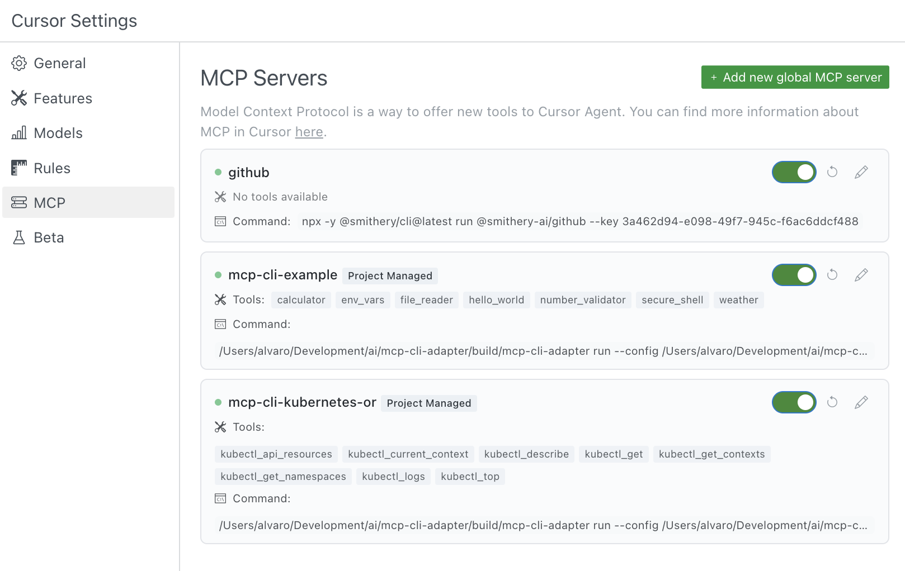

# Using the MCPShell in Cursor

## What is MCP?

The Model Context Protocol (MCP) is an open protocol that standardizes how applications provide context and tools to LLMs. It acts as a plugin system for Cursor, allowing you to extend the AI's capabilities by connecting it to various data sources and tools through standardized interfaces.

The MCPShell lets you expose command-line tools to Cursor's AI, enabling it to interact with your system, run commands, and process their output.

## Setting Up MCPShell

### Step 1: Define your tools in YAML

Create a `mcp-cli.yaml` file with your tool definitions:

```yaml
mcp:
  run:
    shell: bash
  tools:
    - name: "weather"
      description: "Get the weather for a location"
      params:
        location:
          type: string
          description: "The location to get weather for"
          required: true
      constraints:
        - "location.size() <= 50"  # Prevent overly long inputs
      run:
        command: "curl -s 'https://wttr.in/{{ .location }}?format=3'"
```

### Step 2: Configure Cursor to use the adapter

Cursor supports two configuration locations:

1. **Project-specific**: Create a `.cursor/mcp.json` file in your project directory
2. **Global**: Create a `~/.cursor/mcp.json` file in your home directory

The MCPShell uses the "stdio" transport type, which runs locally on your machine.

#### If you have the `go` command available

```json
{
    "mcpServers": {
        "mcpshell": {
            "command": "go",
            "args": [
                "run", "github.com/inercia/MCPShell@v0.1.2",
                "mcp", "--config", "/absolute/path/to/mcp-cli.yaml"
            ]
        }
    }
}
```

#### If you've downloaded the `mcpshell` binary

```json
{
    "mcpServers": {
        "mcpshell": {
            "command": "/absolute/path/to/mcpshell",
            "args": [
                "mcp", "--config", "/absolute/path/to/mcp-cli.yaml"
            ]
        }
    }
}
```

### Step 3: Refresh the Cursor client

After creating or modifying your MCP configuration, reflesh the Cursor client for the changes to take effect.

## Using Multiple MCPShell Instances

You can configure multiple instances of the MCPShell, each with different tool sets and configurations:

```json
{
    "mcpServers": {
        "mcp-cli-examples": {
            "command": "/some/path/mcpshell/build/mcpshell",
            "args": [
                "mcp",
                "--config", "/some/path/mcpshell/examples/config.yaml",
                "--logfile", "/some/path/mcpshell/debug.log"
            ],
            "env": {
            }
        },
        "mcp-cli-kubernetes-ro": {
            "command": "/some/path/mcpshell/build/mcpshell",
            "args": [
                "mcp",
                "--config", "/some/path/mcpshell/examples/kubectl-ro.yaml",
                "--logfile", "/some/path/mcpshell/debug.kubernetes-ro.log"
            ],
            "env": {
                "KUBECONFIG": "/some/path/ethos/kubeconfig/kubeconfig.yaml"
            }
        }
    }
}
```

With this configuration, Cursor will have access to tools from both instances:



## Providing Authentication

You can provide authentication credentials and other sensitive information using environment variables:

```json
{
    "mcpServers": {
        "mcpshell": {
            "command": "/absolute/path/to/mcpshell",
            "args": [
                "mcp", "--config", "/absolute/path/to/mcp-cli.yaml"
            ],
            "env": {
                "API_KEY": "your-api-key-here",
                "SECRET_TOKEN": "your-secret-token"
            }
        }
    }
}
```

## How Cursor Uses MCP Tools

When you chat with Cursor, the AI will:

1. **Automatically detect** when a tool might be useful based on your request
2. **Ask for approval** before running any tool (by default)
3. **Display the results** in the chat conversation

You can prompt Cursor to use specific tools by mentioning them by name or description in your request.

## Tool Approval

By default, when Cursor wants to use an MCP tool, it will display a message asking for your approval. You can:

- View the arguments the tool will be called with
- Approve the tool just once
- Approve the tool for the current session
- Configure auto-run to allow tools to run without approval

## Known Limitations

- **Tool Quantity**: Cursor currently supports up to 40 tools at a time
- **Remote Development**: MCP servers may not work properly when accessing Cursor over SSH or other remote development environments
- **Resources**: Currently, only tools are supported in Cursor; resources are not yet supported

## Troubleshooting

Read the [troubleshooting guide](troubleshooting.md).
