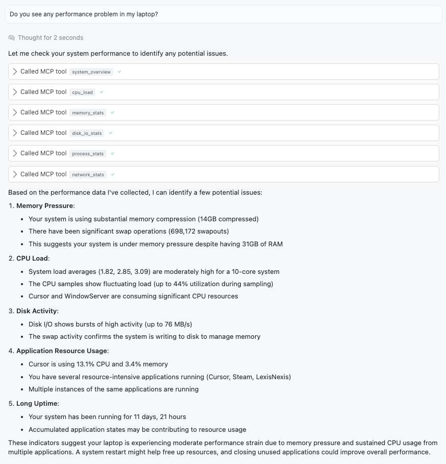
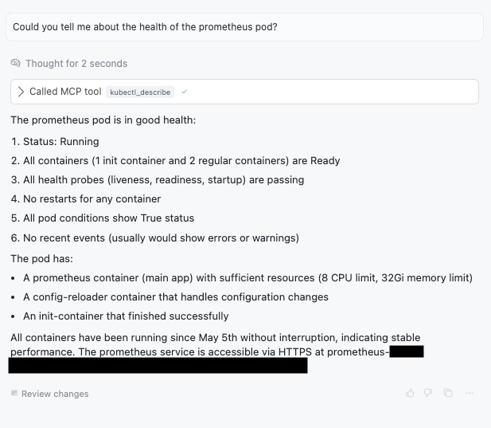

# MCPShell examples

This directory contains some examples of configurations for running
different tools that can be used by your LLM.

Some of the examples are:

- **aws-ro.yaml**, **aws-networking-ro.yaml** and **aws-route53-ro.yaml**: Read-only AWS networking tools for inspecting VPCs, subnets, route53 and network configurations.
- **container-diagnostics-ro.yaml**: Read-only container diagnostics for Docker and containerization tools.
- **disk-diagnostics-ro.yaml**: Tools for analyzing disk usage, finding large files, and checking filesystem health.
- **github-cli-ro.yaml**: Commands for interacting with GitHub repositories, issues, pull requests, and other GitHub resources.
- **kubectl-ro.yaml**: Read-only Kubernetes tools for inspecting cluster resources and configurations.
- **log-analysis-ro.yaml**: Log analysis tools for examining and filtering log files.
- **network-diagnostics-ro.yaml**: Network diagnostic tools for testing connectivity and examining network configurations.
- **security-diagnostics-ro.yaml**: Security-related diagnostic tools for system inspection.
- **system-performance-ro.yaml**: Tools for monitoring and analyzing system performance metrics.

You can add them in Cursor (or any other LLM client with support for MCP tools), and use
it from your AI Chat.

<p align="center">
  
</p>

For the Kubernetes example, you can aks questions about your current cluster, pods and so on:

<p align="center">
  
</p>

Some other examples are just for demonstrating the configuration file format and paramters
(like all the `config*yaml`).

## Using STDIN with the Agent

The agent command supports reading from STDIN as part of the prompt. This is useful when you want to
pipe log files, error messages, or other text content for the LLM to analyze.

Use `-` as a placeholder in the arguments to represent STDIN content:

```bash
# Analyze a log file
cat error.log | mcpshell agent --tools log-analysis-ro.yaml \
  "I'm seeing errors in this log file:" - "Please help me understand what went wrong."

# Debug Kubernetes issues
kubectl logs my-pod | mcpshell agent --tools kubectl-ro.yaml \
  "Here are the logs from a failing pod:" - "What's causing the failure?"

# Examine system performance
ps aux | mcpshell agent --tools system-performance-ro.yaml \
  "Current process list:" - "Which processes are using the most resources?"
```

**Note:** When STDIN is used, the agent automatically runs in `--once` mode (single interaction)
since STDIN is no longer available for interactive input.

## Creating your own scripts with Cursor

Most of the examples in this directory have been generated automatically
with Cursor. If you want to create your own toolkit, you can open the Cursor
chat and type something like.

```text
Please take a look at the examples found in
https://github.com/inercia/MCPShell/tree/main/examples.
They are YAML files that define groups of tools that can be used by an LLM.
The configuration format is defined in
https://github.com/inercia/MCPShell/blob/main/docs/config.md
Please create a new configuration file for running [YOUR COMMAND].
Add constraints in order to make the command execution safe,
checking paramters and so on.
Provide only read-only commands, do not allow the execution
of code with side effects.
Validate the example generated with
"go run github.com/inercia/MCPShell@v0.1.5 validate --tools FILENAME"
where FILENAME is the configuration file you have created.
If some errors are detected by the validation process, please try to fix them
until the validation is successful.
```

Once that Cursor has generated a configuration file, run the
`mcpshell validate` command in order to validate the file.
If it doesn't validate, pass the errors to Cursor (or allow
Cursor to run this command automatically). Cursor should be able
to fix these errors.

Please submit your toolkit to this repository if you consider
it useful for the community.
